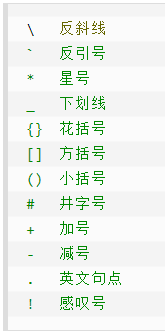

- [文本段落](#文本段落)
  - [标题](#标题)
  - [段落换行](#段落换行)
  - [字体](#字体)
  - [各种线](#各种线)
    - [分割线](#分割线)
    - [删除线](#删除线)
    - [下划线](#下划线)
    - [角注](#角注)
- [列表](#列表)
  - [无序列表](#无序列表)
  - [有序列表](#有序列表)
  - [列表嵌套](#列表嵌套)
- [区块](#区块)
  - [区块里面的列表:](#区块里面的列表)
  - [列表里的区块](#列表里的区块)
- [代码区块](#代码区块)
  - [代码片段](#代码片段)
  - [代码区块方法(可备注语言)](#代码区块方法可备注语言)
- [链接](#链接)
- [图片](#图片)
- [表格](#表格)
- [公式](#公式)
  - [公式标记](#公式标记)
  - [基本语法](#基本语法)
  - [运算符号](#运算符号)
  - [希腊字母](#希腊字母)
  - [矩阵表示](#矩阵表示)
    - [基本语法](#基本语法-1)
    - [边框格式](#边框格式)
    - [阵列](#阵列)
  - [方程组](#方程组)
- [其他](#其他)
  - [支持 html 元素](#支持-html-元素)
  - [字符表](#字符表)
  - [vscode 插件生成目录(create table of contents)](#vscode-插件生成目录create-table-of-contents)

# 文本段落

## 标题

```markdown
# 一级标题

## 二级标题

### 三级标题

#### 四级标题

##### 五级标题

###### 六级标题
```

## 段落换行

p1 段落换行:两个空格加回车  
p2 段落换行:空一行

p3

## 字体

```markdown
_斜体文本_

_斜体文本_

**粗体文本**

**粗体文本**

**_斜粗体文本_**

**_斜粗体文本_**
```

## 各种线

### 分割线

```markdown
---
```

---

### 删除线

```markdown
~~删除线文本~~
```

~~删除线文本~~

### 下划线

```markdown
<u>下划线文本</u>
```

<u>下划线文本</u>

### 角注

# 列表

## 无序列表

```markdown
- 第一项

- 第二项

- 第三项
```

- 第一项

- 第二项

- 第三项

## 有序列表

```markdown
1. 第一项
2. 第二项
3. 第三项
```

1. 第一项
2. 第二项
3. 第三项

## 列表嵌套

```markdown
1. 第一项:
   - 第一项的第一个嵌套元素
   - 第一项的第二个嵌套元素
```

1. 第一项:
   - 第一项的第一个嵌套元素
   - 第一项的第二个嵌套元素

# 区块

```markdown
> 区块
> 区块
>
> > 第二层嵌套区块
> > 第二层嵌套区块
> >
> > > 第三层嵌套区块
```

> 区块
> 区块
>
> > 第二层嵌套区块
> > 第二层嵌套区块
> >
> > > 第三层嵌套区块

## 区块里面的列表:

```markdown
> 1. 第一项
> 2. 第二项
>
> - 第三项
```

> 1. 第一项
> 2. 第二项
>
> - 第三项

## 列表里的区块

```markdown
- 第一项
  > 区块
  > 区块
  >
  > > 嵌套区块
- 第二项
```

- 第一项
  > 区块
  > 区块
  >
  > > 嵌套区块
- 第二项

# 代码区块

## 代码片段

```markdown
`demo`代码片段
```

`demo`代码片段

## 代码区块方法(可备注语言)

````markdown
```java
class{

}
```
````

```java
class{

}
```

# 链接

```markdown
[链接 1](www.baidu.com)
<http://www.baidu.com>
```

[链接 1](www.baidu.com)
<http://www.baidu.com>

# 图片

两种方式:

```markdown


```


# 表格

```markdown
| 表头   | 表头   |
| ------ | ------ |
| 单元格 | 单元格 |
| 单元格 | 单元格 |
```

| 表头   | 表头   |
| ------ | ------ |
| 单元格 | 单元格 |
| 单元格 | 单元格 |

三种对齐方式:

```markdown
| 左对齐   | 右对齐 | 居中对齐 |
| :------- | -----: | :------: |
| 单元格   | 单元格 |  单元格  |
| _单元格_ | 单元格 |  单元格  |
```

| 左对齐   | 右对齐 | 居中对齐 |
| :------- | -----: | :------: |
| 单元格   | 单元格 |  单元格  |
| _单元格_ | 单元格 |  单元格  |

# 公式

## 公式标记

- 行内公式(inline)
  ```markdown
  这是一个行内公式$f(x)=x_1^2+x_2$
  ```
  这是一个行内公式$f(x)=x_1^2+x_2$
- 独行公式(displayed)
  ```markdown
  这是一个独行公式
  $$f(x)=x_1^2+x_2$$
  ```
  这是一个独行公式
  $$f(x)=x_1^2+x_2$$

## 基本语法

- 上下标

  - `_`表示下标`^`表示上标,例:`$f(x)=x_1^2+x_2$`=$f(x)=x_1^2+x_2$
  - 大括号`{}`消除二义性以及界定结合性,例:`${^1_2}A{^3_4}$`=${^1_2}A{^3_4}$

- 括号
  - 小括号`()`和方括号`[]`:和原始一样正常显示
  - 大括号`{}`:用于界定块,因此要显示需要转义字符,例:`$\{ \}$`==$\{\}$
  - 尖括号`<>`:使用`\langle` 和`\rangle` 分别表示左尖括号和右尖括号,例:`$\langle \rangle$`==$\langle \rangle$
  - 上取整:使用`\lceil` 和`\rceil` 表示。例:`$\lceil x \rceil$`==$\lceil x\rceil$
  - 下取整:使用`\lfloor` 和`\rfloor` 表示。例:`$\lfloor x\rfloor$`==$\lfloor x\rfloor$
  - 上大括号:使用`\overbrace{算式}`表示。例:`$\overbrace{a+b+c}^{2.0}$`==$\overbrace{a+b+c}^{2.0}$
  - 下大括号:使用`\underbrace{算式}`表示。例:`$a+\underbrace{b+c}_{1.0}+d$`==$a+\underbrace{b+c}_{1.0}+d$
  - 超大括号:使用`\big(\big) \Big(\Big) \bigg(\bigg) \Bigg(\Bigg)`。例:`$\big(\big) \Big(\Big) \bigg(\bigg) \Bigg(\Bigg)$`=$\big(\big) \Big(\Big) \bigg(\bigg) \Bigg(\Bigg)$
  - 自适应括号:加上`\left`和`\right`,例:`$\left\langle (a+b+c)^{2.0} \right\rangle$`==$\left\langle (a+b+c)^{2.0}\right\rangle$
- 占位符
  - 两个 quad 空格`\qquad`,例:`$x\qquad y$`=$x\qquad y$
  - quad 空格`\quad`,例:`$x\quad y$`=$x\quad y$
  - 大空格`\ `,例:`$x\ y$`=$x\ y$
  - 中空格`\:`,例:`$x\:y$`=$x\:y$
  - 小空格`\,`,例:`$x\,y$`=$x\,y$
- 组合公式
  - 带括号`{上位公式 \choose 下位公式}`,例:`${a+b \choose c+d}$`=${a+b \choose c+d}$
  - 不带括号`{上位公式 \atop 下位公式}`,例:`${a+b \atop c+d}$`=${a+b \atop c+d}$
  - 上位符号:`\stacrel{上位符号}{基位符号}`,例:`$\vec{x}\stackrel{\mathrm{def}}{=}{x_1,\dots,x_n}$`==$\vec{x}\stackrel{\mathrm{def}}{=}{x_1,\dots,x_n}$

## 运算符号

- 参考[对照 1](https://www.jianshu.com/p/e74eb43960a1)和[对照 2](https://blog.csdn.net/qq_52254197/article/details/115334049)和[对照 3](https://zhuanlan.zhihu.com/p/138532124)
- 基础符号
- 高级运算
- 逻辑运算
- 集合运算
- 数学符号

## 希腊字母

| 字符 | Markdown  | 字符 | Markdown | 字符 | Markdown    |
| ---- | --------- | ---- | -------- | ---- | ----------- |
| α    | \alpha    | β    | \beta    | γ    | \gamma      |
| δ    | \delta    | ϵ    | \epsilon | ε    | \varepsilon |
| ζ    | \zeta     | η    | \eta     | θ    | \theta      |
| ι    | \iotaι    | κ    | \kappa   | λ    | \lambda     |
| μ    | \mu       | ν    | \nu      | ξ    | \xi         |
| ο    | \omicronο | π    | \pi      | ρ    | \rho        |
| σ    | \sigma    | τ    | \tau     | υ    | \upsilon    |
| φ    | \varphi   | ϕ    | \phi     | χ    | \chi        |
| ψ    | \psi      | ω    | \omega   | Ω    | \bf{\Omega} |

## 矩阵表示

### 基本语法

```markdown
$$
\begin{matrix}
 1 & 2 & 3 \\
 4 & 5 & 6 \\
 7 & 8 & 9
\end{matrix}
$$
```

$$
\begin{matrix}
 1 & 2 & 3 \\
 4 & 5 & 6 \\
 7 & 8 & 9
\end{matrix}
$$

### 边框格式

- 无边框:{matrix}
- 小括号边框:{pmatrix}
- 中括号边框:{bmatrix}
- 大括号边框:{Bmatrix}
- 单竖线边框:{vmatrix}
- 双竖线边框:{Vmatrix}
- 矩阵内容省略号
  - \cdots 为水平方向的省略号
  - \vdots 为竖直方向的省略号
  - \ddots 为斜线方向的省略号

### 阵列

- 起始、结束处以{array}声明
- 对齐方式：在{array}后以{}逐行统一声明
- 左对齐 l, 居中 c, 右对齐 r
- 竖直线:在声明对齐方式时，插入 | 建立竖直线
- 插入水平线:\hline
- 例:

  ```markdown
  $$
  \begin{array}{c|lll}
  {↓}&a&b&c\\
  \hline
  {R_1}&c&b&a\\
  {R_2}&b&c&c\\
  \end{array}
  $$
  ```

  $$
  \begin{array}{c|lll}
  {↓}&a&b&c\\
  \hline
  {R_1}&c&b&a\\
  {R_2}&b&c&c\\
  \end{array}
  $$

## 方程组

- 起始、结束处以{cases}声明
- 例:

  ```markdown
  $$
  \begin{cases}
  a_1x+b_1y+c_1z=d_1\\
  a_2x+b_2y+c_2z=d_2\\
  a_3x+b_3y+c_3z=d_3\\
  \end{cases}
  $$
  ```

  $$
  \begin{cases}
  a_1x+b_1y+c_1z=d_1\\
  a_2x+b_2y+c_2z=d_2\\
  a_3x+b_3y+c_3z=d_3\\
  \end{cases}
  $$

# 其他

## 支持 html 元素

- 基础常用
  - `<h1> to <h6>`标题
  - `<p>`段落
  - `<br>`换行
  - `<hr>`水平线
  - [hmtl 实体字符](https://www.runoob.com/tags/ref-entities.html)
- img 标签插入图片
- font 字体

## 字符表

- 转义字符
  

- [hmtl 实体字符](https://www.runoob.com/tags/ref-entities.html)
  - html 预留字符
  - ISO 8859-1 字符实体

## vscode 插件生成目录(create table of contents)
