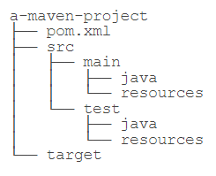
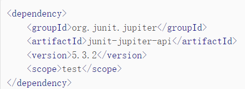
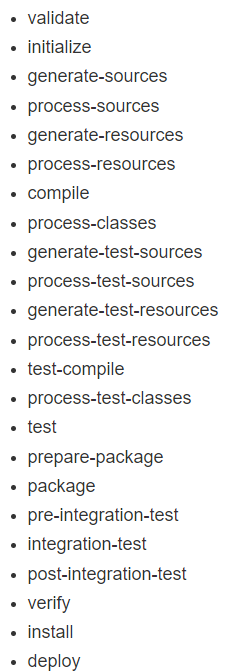
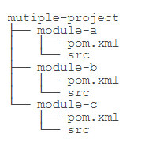

- [maven 介绍与配置 setting.xml](#maven-介绍与配置-settingxml)
- [maven pom.xml](#maven-pomxml)
- [maven 标准化构建流程](#maven-标准化构建流程)
- [maven 模块管理](#maven-模块管理)
- [Maven Wrapper(mvnw)版本管理](#maven-wrappermvnw版本管理)
- [发布 Artifact](#发布-artifact)

# maven 介绍与配置 setting.xml

- Maven 就是是专门为 Java 项目打造的管理和构建工具，它的主要功能有：

  - 提供了一套标准化的项目结构；
  - 提供了一套标准化的构建流程（编译，测试，打包，发布……）；
  - 提供了一套依赖管理机制。

- 定义项目结构  
  

  - 项目描述文件 pom.xml
  - Java 源码的目录是 src/main/java
  - 存放资源文件的目录是 src/main/resources
  - 存放测试源码的目录是 src/test/java
  - 存放测试资源的目录是 src/test/resources
  - 编译、打包生成的文件都放在 target 目录

- 配置文件 setting.xml(windows 机器一般在 maven 安装目录的 conf/settings.xml)
  - 配置 maven 阿里云镜像仓库(同 nodejs)加快下载速度`<mirror>`
    打开 maven 的配置文件,添加 mirror 子节点:
    ```html
    <mirror>
      <id>aliyunmaven</id>
      <mirrorOf>\*</mirrorOf>
      <name>阿里云公共仓库</name>
      <url>https://maven.aliyun.com/repository/public</url>
    </mirror>
    ```
  - 配置 maven 本地仓库
    1. maven 目录下新建文件夹 repository
    2. setting.xml 中新增`<localRepository>D:\Environment\apache-maven-3.8.5\repository</localRepository>`
- 搜索第三方组件[https://search.maven.org/](https://search.maven.org/)

# maven pom.xml

POM(Project Object Model，项目对象模型)是 Maven 工程的基本工作单元,是一个 XML 文件,包含了项目的基本信息,用于描述项目如何构建,声明项目依赖等等。执行任务或目标时,Maven 会在当前目录中查找 POM。它读取 POM,获取所需的配置信息,然后执行目标。POM 中可以指定以下配置：

- 项目信息
  - groupId
  - artifactId
  - version
  - packaging 打包方式:jar 和 war
- 项目开发者列表
- 配置信息 properties
  - project.build.sourceEncodeing 编码信息
- 项目依赖(dependencies)
  - \<dependency\>声明依赖。groupId (属于组织名称),artifactId (jar 包名称),version (jar 包版本)作为唯一标识  
    
  - 四种依赖关系
    |scope|说明|示例|
    |---|---|---|
    |compile|编译时需要用到该 jar 包（默认）|commons-logging|
    |test|编译 Test 时需要用到该 jar 包|junit|
    |runtime|编译时不需要，但运行时需要用到|mysql|
    |provided|编译时需要用到，但运行时由 JDK 或某个服务器提供|servlet-api|
  - pom.xml 声明依赖后 maven 从中央仓库把所需依赖下载到本地
- 项目构建(build)
  - 插件(plugins)

# maven 标准化构建流程

- maven 生命周期:一系列 phase
  `defult`包含的`phase`  
  
- 常用指令
  - `mvn package`:Maven 就会执行 default 生命周期，从开始一直运行到 package 这个 phase 为止
  - `mvn compile`:Maven 也会执行 default 生命周期，运行到 compile
  - `mvn clean`:清理所有生成的 class 和 jar
  - `mvn clean compile`:先清理，再执行到 compile
  - `mvn clean test`:先清理，再执行到 test
  - `mvn clean package`:先清理，再执行到 package
- 实现过程:调用相应插件(plugin)(如:执行 compile 这个 phase，这个 phase 会调用 compiler 插件执行关联的 compiler:compile)

  | 插件名称 | 对应执行的 phase |
  | -------- | ---------------- |
  | clean    | jar              |
  | compiler | compile          |
  | surefire | test             |
  | jar      | package          |

  `maven-shade-plugin`可以创建一个可执行的 jar，要使用这个插件，需要在 pom.xml 的 build ->plugins ->plugin 中声明

# maven 模块管理

- 把每个模块当作一个独立的 Maven 项目，它们有各自独立的`pom.xml`  
  

# Maven Wrapper(mvnw)版本管理

实现不同项目不同 maven 版本的管理

# 发布 Artifact
