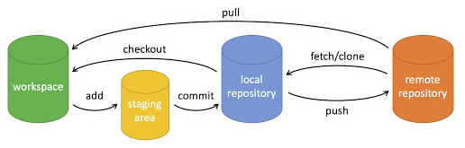

# 工作流与常用命令

- 工作流程及命令
    - 
    - workspace：工作区
    - staging area：暂存区/缓存区
    - local repository：版本库或本地仓库
    - remote repository：远程仓库
- 回退版本
    - `git reset`:回退节点
    - `git revert`:新建回退版本的节点
- 其他命令
    - `git config`:设置
    - `git status`:查看当前仓库状态
    - `git diff`:比较暂存区和工作区差异
    - `git init`:初始化仓库
    - `git rm`:将文件从暂存区和工作区中删除
    - `git mv`:移动或重命名工作区文件
    - `git log`:查看历史提交记录
    - `git blame <file>`:以列表形式查看指定文件的历史修改记录
    - `git remote`:远程仓库操作
- git分支管理
    - `git branch`:列出本地分支
    - `git branch (branchname)`:创建分支,`-f`重新分配分支
    - `git checkout (branchname)[^/~n]`:切换分支,`^`parent,`~n`move to parent for n times
    - 合并分支
        - `git merge 分支2`:当前分支并分支2内容,并创建新提交
        - `git rebase 分支2`:将当前分支的修改“衍合”（rebase）到目标分支的最新提交之后