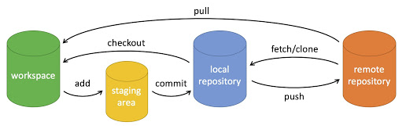

- [git简介](#git简介)
- [初始化与信息查看](#初始化与信息查看)
- [远程仓库到本地](#远程仓库到本地)
- [工作区到暂存区](#工作区到暂存区)
- [暂存区到远程仓库](#暂存区到远程仓库)
- [回退版本](#回退版本)
- [git分支管理](#git分支管理)
- [其他命令](#其他命令)

# git简介

- 工作流程及命令
  - 
  - workspace：工作区
  - staging area：暂存区/缓存区
  - local repository：版本库或本地仓库
  - remote repository：远程仓库

# 初始化与信息查看

- `git config`:设置
- `git status`:查看当前仓库状态
- `git diff`:比较暂存区和工作区差异
- `git init`:初始化仓库
- `git log`:查看历史提交记录
- `git blame <file>`:以列表形式查看指定文件的历史修改记录
- `git remote`:远程仓库操作
  - `-v`可查看关联的远程仓库

# 远程仓库到本地

- `git clone`：第一次把远程仓库完整地“拷贝”到本地（适用于从零开始）
- `git pull`：之后把远程仓库的“新更新”拉下来并合并到本地（适用于更新已有的项目）

# 工作区到暂存区

- `git add`:将工作区更改提交到暂存区
  - `.`：工作区全部内容提交到暂存区

# 暂存区到远程仓库

- `git commit`：提交到远程仓库
  - `-m "提交说明"`：直接写提交说明

# 回退版本

- `git reset`:回退节点
- `git revert`:新建回退版本的节点

# git分支管理

- `git branch`:列出本地分支
- `git branch (branchname)`:创建分支,`-f`重新分配分支
- `git checkout (branchname)[^/~n]`:切换分支,`^`parent,`~n`move to parent for n times
- 合并分支
  - `git merge 分支2`:当前分支并分支2内容,并创建新提交
  - `git rebase 分支2`:将当前分支的修改“衍合”（rebase）到目标分支的最新提交之后

# 其他命令

- `git rm`:将文件从暂存区和工作区中删除
- `git mv`:移动或重命名工作区文件
