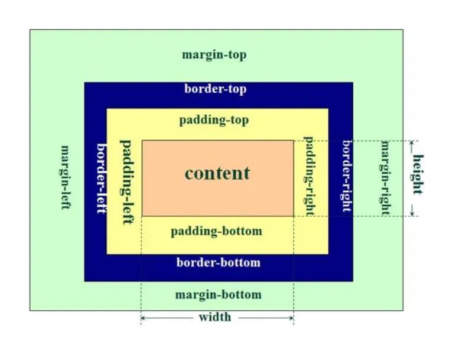

- [html](#html)
  - [html 简介](#html-简介)
  - [html 手册](#html-手册)
- [css](#css)
  - [css 简介](#css-简介)
  - [基本语法](#基本语法)
  - [导入方式](#导入方式)
  - [选择器](#选择器)
  - [html 元素 css 属性](#html-元素-css-属性)
  - [css 盒子模型](#css-盒子模型)

# html

## html 简介

超文本标记语言(Hyper Text Markup language,HTML),描述网页骨架内容,即 HTML 元素,浏览器负责解析产生页面,期间联系 css 渲染,javascript 控制

## html 手册

- [html 标签手册](https://www.runoob.com/tags/ref-byfunc.html)
  - 基础
  - 格式
  - 表单
  - 框架
  - 图像
  - audio/video
  - 链接
  - 列表
  - 表格
  - 样式/布局
  - 元信息
  - 程序
- [html 全局属性](https://www.runoob.com/tags/ref-standardattributes.html)
- [html 事件属性](https://www.runoob.com/tags/ref-eventattributes.html)
  - 窗口事件
  - 表单事件
  - 键盘事件
  - 鼠标事件
  - 多媒体事件
  - 其他事件
- [hmtl 实体字符](https://www.runoob.com/tags/ref-entities.html)
  - html 预留字符
  - ISO 8859-1 字符实体

# css

## css 简介

层叠样式表 (Cascading Style Sheets,css),定义如何显示 HTML 元素

## 基本语法

```css
选择器 {
  属性: 值;
  属性: 值;
  ...;
  /*注释*/
}
```

## 导入方式

- 内部样式

  ```html
  <style>
    选择器 {
      属性: 值;
      属性: 值;
      ...;
    }
  </style>
  ```

- 外部样式:外联 css 文件 1.内容和表现分离 2.方便复用 3.利用 SEO,容易被搜索引擎收录

  ```html
  <link rel="stylesheet" href="css文件源" />
  ```

- 行内样式:在标签元素中，编写 style 属性,样式,一般用于少量且单次生效

  ```html
  <标签 style="属性: 值;">
  ```

- 优先级:行内样式最大，内部样式和外部样式覆盖原则(最后的生效)

## 选择器

[选择器手册](https://www.runoob.com/cssref/css-selectors.html)

- 基础选择器
  - 选择全部
    ```css
    * {
      属性: 值;
      属性: 值;
      ...;
    }
    ```
  - 标签选择器
    ```css
    标签 {
      属性: 值;
      属性: 值;
      ...;
    }
    ```
  - id 选择器:id 一般用于标识唯一 html 元素
    ```css
    #id名 {
      属性: 值;
      属性: 值;
      ...;
    }
    id名在标签id属性中定义
    ```
  - class 选择器:可以用于描述一组 html 元素
    ```css
    .class名 {
      属性: 值;
      属性: 值;
      ...;
    }
    class名在标签class属性中定义
    ```
- 高级选择器

  - 后代选择器:选择器 1 的 html 元素内的所有选择器 2 的 html 元素
    ```css
    选择器1 选择器2 {
      属性: 值;
      属性: 值;
      ...;
    }
    ```
  - 子元素选择器:选择器 1 的 html 元素的选择器 2 的一级子元素
    ```css
    选择器1 > 选择器2 {
      属性: 值;
      属性: 值;
      ...;
    }
    ```
  - 相邻兄弟选择器:选择紧接选择器 1 后的 html 元素的另一选择器 2 的一个元素,且二者有相同父元素
    ```css
    选择器1 + 选择器2 {
      属性: 值;
      属性: 值;
      ...;
    }
    ```
  - 后续兄弟选择器:选择紧接选择器 1 后的 html 元素的另一选择器 2 的所有元素,且二者有相同父元素
    ```css
    选择器1 ~ 选择器2 {
      属性: 值;
      属性: 值;
      ...;
    }
    ```
  - 伪类选择器:选择器的 html 元素满足某种判定条件样式才生效
    ```css
    选择器:判定条件 {
      属性: 值;
      属性: 值;
      ...;
    }
    ```
  - 属性选择器:选择具有指定属性的 html 元素

    ```css
    选择器[属性="单词"] {
      <!-- 比较符号:=(属性完全相等于单词),~=(属性中包含独立单词),|=(属性中允许以-分隔单词),^=(属性前几个字母是单词),$=(属性中以单词结尾),*=(属性中能拆解出单词) -->
      属性: 值;
      属性: 值;
      ...;
    }
    ```

- 优先级:

## html 元素 css 属性

- [css 属性参考手册](https://www.runoob.com/cssref/css-reference.html)

## css 盒子模型



- margin(外边距)
- border(边框)
- padding(内边距)
- content(内容)
