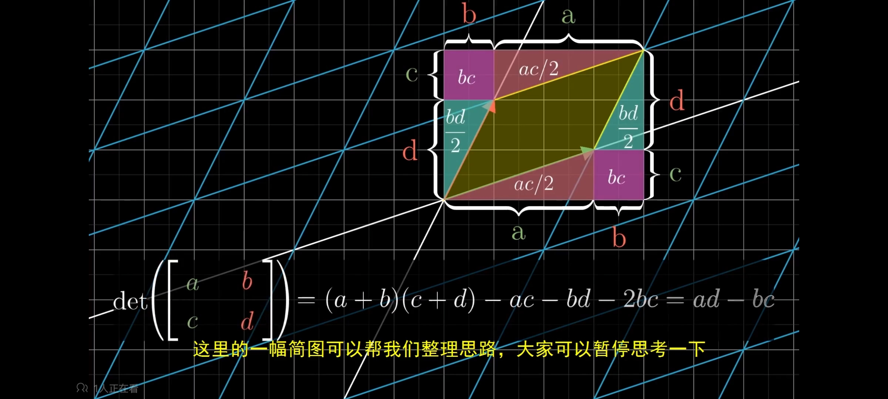

- [向量](#向量)
  - [向量两种角度](#向量两种角度)
  - [向量两种基本运算](#向量两种基本运算)
- [空间角度下的线性代数 Essense of Linear Algebra](#空间角度下的线性代数essense-of-linear-algebra)
- [数值角度下的线性代数](#数值角度下的线性代数)

# 向量

- 抽象向量空间
  - 对象集具有:向量加法与数乘的八条公理。。图。。都可以应用线性代数的工具和思想
  - 空间角度下的向量和数值角度下的向量都只是一种具体形态下的向量空间,其他形态还有:函数集等

## 线性组合

- 线性代数的两种基本运算
  - 向量相加
  - 数乘向量
- 线性组合:任意数量向量分别进行数乘运算的结果进行向量相加

## 抽象向量空间

- 对象集具有:向量加法与数乘的八条公理。。图。。都可以应用线性代数的工具和思想
- 空间角度:
  - 带方向的箭头:方向+长度
  - 两种描述空间向量方式:
    - 基底+坐标:上标表示逆变分量,如$V^1$
    - 基底+向量与各基向量点积:下标表示协变分量,如$V_1$
- 数值角度:数字列表
- 空间角度下的向量和数值角度下的向量都只是一种具体形态下的向量空间,其他形态还有:函数集等

# 空间角度下的线性代数[Essense of Linear Algebra](https://www.bilibili.com/video/BV1Ys411k7yQ?spm_id_from=333.337.search-card.all.click)

- 张成向量空间
  - 基底(坐标系)与基底线性组合参数(坐标):数量等于维度的线性无关的向量组,其中向量称为基向量=>向量空间中的任意一个向量可以唯一表示成基向量的线性组合,线性组合的参数即坐标
  - 向量张成空间:向量组中的向量进行线性组合所能描述的空间
  - 线性相关:一个向量组中,存在一个向量落在其他向量张成的空间内，或者说可以表示为其他向量的线性组合=>该向量组线性相关。反之,不满足则线性无关
- 线性变换:
  - 空间变换的一种,原点不变,空间网格线平行且等距分布,因此线性变换对空间的缩放拉伸作用处处相等。
  - 一个向量的坐标系改变,但坐标不变,向量组(矩阵)乘向量,即根据坐标对坐标系做线性组合,可以由经过空间变换后的基底描述之前同一坐标下的经过变化的向量,也可以说,是描述向量经线性变换后的向量。
  - 进一步,向量组 a 乘向量组 b,即对 b 基底(坐标系)进行 a 线性变换,或者基向量先进行 b 线性变换再进行 a 线性变换的叠加
  - 线性变换后张成空间为 n 维,则线性变换秩为 n,满维度-秩=线性变换压缩的维度,如等于 3,可为三维空间压缩成一个点,为 2 可为平面压缩成一个点,为 1 可为一条线压缩成一个点
  - 正交变换:线性变换的一种空间旋转，不改变向量与基底点积,det 为 1,即空间无伸缩
  - 证明:A\*$A(-1)$=1,显然先进行一次线性变换再进行一次相反的线性变换等于没进行任何线性变换
- 线性变换证明(AB)C=A(BC):都是对标准基按顺序施加 C,B,A 线性变换
- 矩阵:向量组描述 or 坐标系描述(基向量组) or 线性变换描述(标准坐标变换到新坐标系)
- 矩阵的逆:描述进行相反的线性变换
- 非方阵的矩阵几何意义:

  - 列数少于行数:将低维空间映射到高维空间
  - 列数多于行数:高维空间映射到低维空间

- 行列式
  - 线性变换对空间的拉伸缩放比例,因此行列式的值为 0,表示该变换产生了降维,且无逆变换即升维,行列式的值为负,表示空间定向发生了改变
  - 三维空间行列式的定向可以用右手定则判断
  - 从空间变换角度推导二维行列式的值的计算公式
    
  - 从空间变换角度推导 det(AB)=det(A)\*det(B)
- 求解常系数线性方程组:空间角度,已知某种线性变换以及变换后的向量,求线性变换前的向量,等同于对结果向量进行相反的线性变换
- 零空间:线性变换后压缩到 0 向量的空间,对应线性齐次方程组的解
- 秩:矩阵列空间的维度,满秩==维度等于列数
- 叉积:叉积是两个向量的运算,结果是一个向量,垂直与两向量平面,值为两向量构成的平行四边形面积。求法：二维：行列式的几何意义，三维推导过程:
  p 向量为所求目标叉积向量,$\begin{vmatrix}x&y&z\\\end{vmatrix}$为空间任意向量,等式由叉积的几何意义以及行列式的几何意义得到
  $$
  \begin{vmatrix}
  p_1\\
  p_2\\
  P_3\\
  \end{vmatrix}*\begin{vmatrix}x&y&z\end{vmatrix}=\begin{vmatrix}
  x&v_1&w_1\\
  y&v_2&w_2\\
  z&v_3&w_3\\
  \end{vmatrix}=>p_1=\begin{vmatrix}v_2&w_2\\v_3&w_3\end{vmatrix},p_2=\begin{vmatrix}v_1&w_1\\v_3&w_3\end{vmatrix},
  p_3=\begin{vmatrix}v_1&w_1\\v_3&w_3\end{vmatrix}
  $$
  即:
  $$
  \begin{vmatrix}
  i&v_1&w_1\\
  j&v_2&w_2\\
  z&v_3&w_3\\
  \end{vmatrix}
  $$
- cramer 法则:

  $$
  原待求向量叉积空间(对角1矩阵替换对应列,行列式值可化为x or y or z)=\frac{线性变换后向量叉积空间(原线性变换替换对应的行列式)}{线性变换拉伸系数(行列式的值)}
  $$

- 点积与投影的关系:
  - 由对称性:点积=>1\*n 矩阵所做线性变换,即将向量空间投影到对应 n\*1 向量所在直线再乘向量长度(如果该向量是单位向量则投影即所作变换结果不用乘向量长度)。该线性变换的几何意义与点积的几何意义一致,同样与非仿真的矩阵几何意义一致
- 相似矩阵:将标准坐标系下的 A 线性变换转化成 P 坐标系下的 B 线性变换,$P^{-1}AP=B$
  - 理解:P 坐标系下的$v$向量经$Pv$,转成标准坐标系坐标。再由$APv$,标准坐标系下进行 A 线性变换,最后左乘$P^{-1}$转成$P$坐标系下坐标。即$P^{-1}APv=Bv=>P^{-1}AP=B$
- 特征值和特征向量:

  - 指定线性变换下,特征向量不离开其张成直线,线性变换对其仅进行拉伸缩放作用,伸缩比例为特征值。
  - 同一特征值下,特征向量张成空间上所有向量都是指定线性变换对应特征值的特征向量
  - 三维空间中,线性变换特征值为 1 的变换为选择
  - 特征基:坐标系的基向量都为特征向量,此时特征基中的线性变换只对特征基向量进行伸缩变换。。。公式:原矩阵=特征基的逆\*特征值对角阵\*特征基。。对角线上元素就是特征向量对应特征值
  - 多次相同线性变换求法(前提：线性变换的特征向量能张成整个空间,即所有特征向量组合成特征基):将标准坐标系转化成特征向量组成的坐标系(特征基),进行多次线性变换后(此时线性变换对特征基向量只进行伸缩),再转回基坐标系(特征基的逆变换)
    。。。公式。。。
  - 二阶矩阵特征值技巧求法:
    - 特征值与 det 关系
    - 特征值与迹关系
    - 公式

# 数值角度下的线性代数

- 矩阵表示线性方程组
