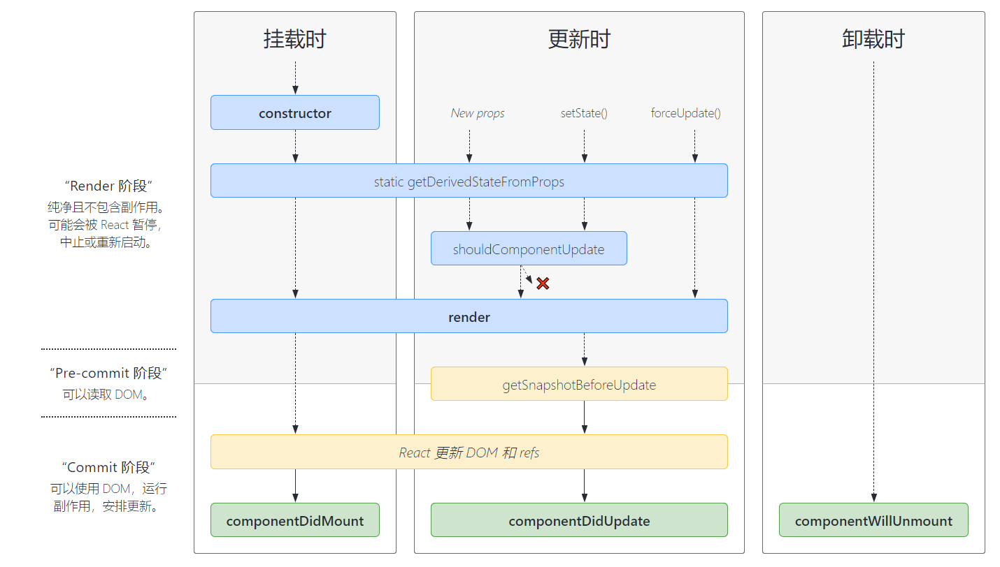

- [引入 react](#引入-react)
  - [官方文档](#官方文档)
  - [script 标签引入](#script-标签引入)
    - [CND 分发引入](#cnd-分发引入)
    - [本地引入](#本地引入)
  - [工具链](#工具链)
- [JSX](#jsx)
  - [引入 JSX](#引入-jsx)
  - [语法](#语法)
- [react 渲染](#react-渲染)
  - [渲染 react 对象](#渲染-react-对象)
  - [条件渲染](#条件渲染)
  - [列表&key](#列表key)
- [组件](#组件)
  - [定义组件语法:必须大写字母开头](#定义组件语法必须大写字母开头)
  - [组件的生命周期](#组件的生命周期)
  - [组件 react 事件](#组件-react-事件)
  - [表单](#表单)
  - [状态提升](#状态提升)
  - [井字棋例](#井字棋例)
  - [react hooks](#react-hooks)
- [react router v6](#react-router-v6)
  - [引入](#引入)
  - [react router 的组件](#react-router-的组件)
    - [路由设置](#路由设置)
    - [Link 组件](#link-组件)
    - [动态路由 (url 传递参数)](#动态路由-url-传递参数)
    - [索引路由](#索引路由)
    - [活动链接(NavLink)](#活动链接navlink)
    - [搜索参数](#搜索参数)
    - [事件触发跳转](#事件触发跳转)
- [前后端交互:axios 请求](#前后端交互axios-请求)
- [js-cookie](#js-cookie)

# 引入 react

## [官方文档](https://zh-hans.reactjs.org/docs/getting-started.html)

## script 标签引入

### CND 分发引入

- 开发环境
  ```javascript
  <script src="https://unpkg.com/react@18/umd/react.development.js"></script>
  <script src="https://unpkg.com/react-dom@18/umd/react-dom.development.js"></script>
  ```
- 生产环境
  ```javascript
  <script src="https://unpkg.com/react@18/umd/react.production.min.js"></script>
  <script src="https://unpkg.com/react-dom@18/umd/react-dom.production.min.js"></script>
  ```

### 本地引入

- `npm install react`,`npm install react-dom`
- 用 script 标签从 modules 引入
- 或者 import 模块
  ```javascript
  import React from "react";
  import ReactDOM from "react-dom";
  ```

## 工具链

- 使用 node 命令安装 react 项目:`npx create-react-app my-app `
- 已经自动引入 JSX 和 react
- 运行脚本(package.json 文件中可查看)
  - config 和 scripts 文件隐藏了。暴露指令命令(永久性):`npm run eject`
  - 启动项目:`npm start`
  - 打包项目:`npm run build`

# JSX

JSX 仅仅只是 React.createElement(component, props, ...children) 函数的语法糖,生成 React 元素。Babel 会把 JSX 转译成一个名为 React.createElement() 函数调用生成一个 react 元素。

## 引入 JSX

- 方法 1:script 标签引入
  - script 标签引入`<script src="https://unpkg.com/babel-standalone@6/babel.min.js"></script>`
  - script 代码块加上`type="text/babel"`
- 方法 2: JSX 预处理器

## 语法

- html 标签语法创建 react 元素
- 大括号包含有效的 JavaScript 表达式

# react 渲染

## 渲染 react 对象

- 传入 DOM 对象创建 react 对象:语法`react 对象=ReactDOM.createRoot(获取的DOM对象)`
- 渲染语法:`react 对象.render(react元素)`或者`ReactDOM.render(react元素,获取的DOM对象)`
- react 元素不可变,因此只能用 render 函数更新 UI

## 条件渲染

- if 分支
- JavaScript 中，true && expression 总是会返回 expression, 而 false && expression 总是会返回 false
- 三目运算符 condition ? true : false

## 列表&key

- `map()`将数据源循环映射成 react 元素并叠加
- 建议每个 react 元素标签添加独立的 key 标识,方便缓存提高速度

# 组件

本质上就是 JavaScript 函数,接受参数 props,render 返回描述界面的 react 对象

## 定义组件语法:必须大写字母开头

- 方法 1:函数式组件,等于只有 render()方法的组件,结合[react hook](#react-hooks)可以实现方法 2 组件的功能

  ```javascript
  function Welcome(props) {
    return (
      <div>
        <h1>Hello, {props.name}</h1>
      </div>
    );
  }
  ```

- 方法 2:class 方法,继承 `React.Component`,必须有 render 函数

  ```javascript
  class Welcome extends React.Component {
    render() {
      return (
        <div>
          <h1>Hello, {props.name}</h1>
        </div>
      );
    }
  }
  ```

- 组件引用表示:<组件名 prop 参数 />
- 组合组件:组件中也可以引用组件

## 组件的生命周期



- [各阶段 api 函数文档](https://zh-hans.reactjs.org/docs/react-component.html)
- 构造函数:`constructor(props){ super(props); state 初始化; }`
- 渲染函数:`render(){return (react 元素)}`返回组件渲染的结果
- 组件挂载后:`componentDidMount(){}`。[时钟例](./实例/挂载和卸载/挂载和卸载.html)
- 更新 state 值:`this.setstate()`
- prop 和 state 区别:都是用来保存信息的，这些信息可以控制组件的渲染输出。不同点：props 是传递给组件的（类似于函数的形参），而 state 是在组件内被组件自己管 理的（类似于在一个函数内声明的变量）
  - state 由`this.setState(新值)`更新,值更新时,显示在页面上的值也会从新渲染,构造函数是唯一可以给 this.state 赋值的地方。
  - 注意:`this.setState(新值)`更新时用到 props,要构造函数传入参数,防止异步更新

## 组件 react 事件

- component 继承组件时
  - 组件对象内定义事件处理函数,挂载到组件对象的方法
    - 用函数赋值
    - constructor 函数内 bind()可以手动将处理函数挂到组件对象上
  - 内部调用定义的事件处理函数(this)。
- 事件触发类事件,需要调用合成事件 e

## 表单

- 受控组件:value 值与 React 的 state 绑定
  - input 框,[例](实例/表单/受控input框.html)
  - select 框,[例](实例/表单/受控select框.html)
  - 处理多输入:给每个元素添加 name 属性，并让处理函数根据 event.target.name 的值选择要执行的操作[例](实例/表单/受控多个输入框.html)
- 非受控组件:仅在需要值时由 ref 读入 value,[例](./实例/表单/非受控input框.html/)
- 表单不使用 `action` 属性而是 `onSubmit={提交触发的函数}`。提交函数加上读入 e,且加上 e.preventDefault();

## 状态提升

在 React 中，将多个子组件中需要共享的 state 向上移动到它们的最近共同父组件中，便可实现共享 state,即父组件的 state 作为子组件的 prop 源。子组件的共享值改变时,调用传入的父函数,修改父组件的 state。这就是所谓的“状态提升”。[例](./实例/状态提升/状态提升.html)

## [井字棋例](实例/%E4%BA%95%E5%AD%97%E6%A3%8B/)

## react hooks

- react 16.8 版本以上,函数式组件实现 class 继承类组件功能
- [官方文档](https://zh-hans.reactjs.org/docs/hooks-intro.html)
- 需要先`import {useState,useEffect} from "react";`
- state 状态初始化和更新:`const [变量名,set 变量名]=useState(state 初始值);`
- 组件加载或者 render()执行时候发生,setState 发生之后:`useEffect(箭头函数)`,`useEffect(箭头函数,[])`只执行一次

# react router v6

## 引入

- [官方文档](https://reactrouter.com/docs/en/v6)
- 安装`npm install react-router-dom`

- 多页面管理:src 文件中新建 pages 文件夹存放页面 js 文件(单页面完整组件),components 文件夹存放其他组件

## react router 的组件

### 路由设置

- 组件 js 文件中引入`import { BrowserRouter, Routes, Route } from "react-router-dom";`,index.js 文件中才需要 BrowserRouter 其他组件中不需要
- 设置路由(根据当前不同的 url 载入不同的组件),记得提前 import component 或者 pages,\*是通配符匹配其余情况(404)
  ```javascript
  root.render(
    <BrowserRouter>
      <Routes>
        <Route path="/" element={<Login />} />
        <Route path="/App" element={<App />} />
        <Route path="/Second" element={<Second />} />
        <Route path="/Login" element={<Login />} />
        <Route
          path="*"
          element={
            <main style={{ padding: "1rem" }}>
              <p>There's nothing here!</p>
            </main>
          }
        />
      </Routes>
    </BrowserRouter>
  );
  ```
- 嵌套路由:
  - 下例嵌套了 URL ("/" + "expenses"和"/" + "invoices")当子路由匹配时,它将嵌套 UI 组件以进行共享布局：
  ```javascript
  <Routes>
    <Route path="/" element={<App />}>
      <Route path="expenses" element={<Expenses />} />
      <Route path="invoices" element={<Invoices />} />
    </Route>
  </Routes>
  ```
  - App 组件末尾还要加上`<Outlet />`不加子路由组件无法显示
- [例](./实例/路由设置)
- [例](./实例/嵌套路由)

### Link 组件

- 替代 a 标签,实现跳转 url 链接
- 引入:`import { Link } from "react-router-dom"`
- 语法:`<Link to="url">内容</Link>`

### 动态路由 (url 传递参数)

- url 参数匹配符:`:`,例`<Route path=":p" element={<NotFound />} />`,url 中的参数匹配成 p 参数
- 在`<NotFound/>`组件中引用 p 参数,此时`:p->parmas.p`
  ```javascript
  import { useParams } from "react-router-dom";
  export default function NotFound() {
    let params = useParams();
    return <h2>404 not found: {params.p}</h2>;
  }
  ```
- [嵌套路由中同应用例](./实例/路由设置)

### 索引路由

- 放置在父组件下 path 参数替代为 index 参数
  ```javascript
  <Route path="invoices" element={<Invoices />}>
    <Route
      index
      element={
        <main style={{ padding: "1rem" }}>
          <p>Select an invoice</p>
        </main>
      }
    />
    <Route path=":invoiceId" element={<Invoice />} />
  </Route>
  ```
- 什么是索引路由
  - 索引路由在父路由路径的父路由出口中呈现
  - 当父路由匹配但其他子路由都不匹配时，索引路由匹配。
  - 索引路由是父路由的默认子路由。
  - 当尚未匹配子路由列表中的一项时，会呈现索引路由
- [例](./实例/路由设置)

### 活动链接(NavLink)

### 搜索参数

### 事件触发跳转

- `import useNavigate from "react-router-dom"`
- 定义 navigate 避免 react-router 钩子作用域问题:`const navigate = useNavigate();`
- 调用函数`navigate("url")`

# 前后端交互:axios 请求

- 安装:`npm install axios`
- 引入:`const axios = require('axios');`
- 执行 get 请求语法
  ```javascript
  axios
    .get(
      "url",
      {
        params: {
          //参数1:值
          //参数2:值
          //...
        },
      }(可选)
    )
    .then(function (response) {
      //成功响应执行函数;
    })
    .catch(function (error) {
      //响应失败执行函数;
    })
    .then(function () {
      //无论如何都执行的函数
    });
  ```
- 执行 post 请求语法

  ```javascript
  var qs = require("qs");
  axios
    .post("url", qs.stringify(参数)(可选))
    .then(function (response) {
      //成功响应执行函数;
    })
    .catch(function (error) {
      //响应失败执行函数;
    });
  ```

- response 的五个属性
  - 数据:response.data
  - 状态(404,304 等):response.statues
  - response.statusText
  - response.headers
  - response.config
- error 的属性
- 前后端数据通过 json 格式交互
  - json 是一种轻量级的前端后端以及网络传输的数据交换格式
  - json 模块引入:
  - json 字符串处理成 json 对象:`var obj = JSON.parse(data); `
  - json 对象处理成 json 字符串:`var name = JSON.stringify(person);`

# js-cookie

- 引入 cookie 拓展库:`npm install js-cookie`
- 引入:`import Cookies from "js-cookie";`
- 方法
  - 获取 cookie:`Cookies.get("变量名")`
  - 保存 cookie:`Cookies.set("变量名",值,{ expires: 7})`
  - 删除 cookie:`Cookies.remove("变量名");`
